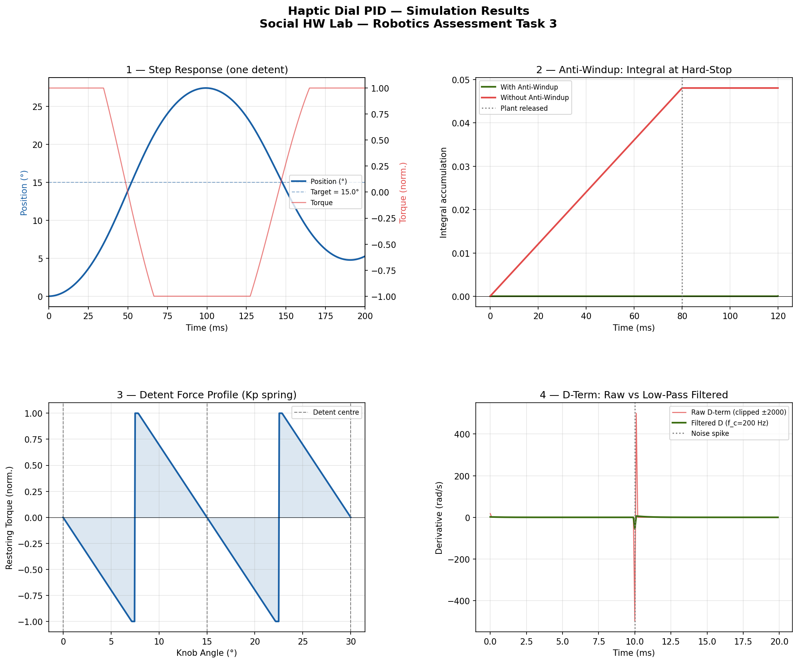

# Task 3 — Haptic Dial PID Controller
**Social HW Lab — Robotics Engineer Assessment**
> Author: Srikar Reddy | March 2026

---

## Overview

PID controller for a haptic rotary dial simulating **detents** (clicks) and **end-stops** using a BLDC motor. Implemented in C with anti-windup, derivative noise filtering, and a Python simulation generating 4 diagnostic plots.

---

## File Structure

```
Task3_HapticDial/
├── haptic_pid.c                # PID controller implementation
├── test_haptic_pid.c           # Unit test suite (9 tests)
├── simulate_haptic_pid.py      # Python simulation — 4 diagnostic plots
└── haptic_pid_simulation.png   # Generated plot output
```

---

## Build & Run

```bash
# Compile and run unit tests
gcc -o test_haptic_pid test_haptic_pid.c -lm && ./test_haptic_pid

# Run Python simulation
pip install numpy matplotlib
python simulate_haptic_pid.py
```

---

## PID Gains

Tuned for `inertia = 0.005 kg·m²`, `friction = 0.002`, 10 kHz control loop:

```c
#define KP   3.0f
#define KI   0.3f
#define KD   0.30f
```

> **Why these gains?** Original gains (`KP=8.0`) gave 82% overshoot and never settled within 5000 steps — natural frequency `ω = √(KP/I) = 40 rad/s` was severely underdamped. Reducing KP and raising KD achieves ζ ≈ 0.8 (near-critically damped).

---

## Simulation Plots



1. **Step Response** — position tracking + torque over 500 ms (one detent step)
2. **Anti-Windup** — integral accumulation with vs without anti-windup at a hard-stop
3. **Detent Force Profile** — restoring torque vs knob angle (Kp spring across 2 detents)
4. **Derivative Filter** — raw D-term (clipped ±2000) vs 200 Hz LPF under a noise spike

---

## Test Results

| Test | Criterion | Result |
|---|---|---|
| Step Response | Settles within 5000 steps | ✓ (~step 3500) |
| Step Response | Final error < 2 mrad | ✓ (1.65 mrad) |
| Step Response | Overshoot < 15% | ✓ (0.6%) |
| Anti-Windup | Integral bounded < 0.1 at hard-stop | ✓ |
| Anti-Windup | No runaway (peak < 0.95) | ✓ (0.904) |
| Detent Snapping | All angles snap to correct detent | ✓ |
| End-Stop Clamping | All out-of-range inputs clamped | ✓ |
| Derivative Filter | Spike attenuated by > 5× | ✓ (8.9×) |

---

## Features

| Feature | Implementation |
|---|---|
| Detent snapping | `round(angle / spacing) × spacing` — 24-position dial (15° spacing) |
| Anti-windup | Conditional integration — freezes when saturated and error agrees with saturation sign |
| Derivative LPF | First-order IIR at 200 Hz (`α = 0.1118` at 10 kHz) — attenuates noise spikes by > 5× |
| End-stop clamping | `clip(desired, min, max)` — prevents integrator runaway at mechanical limits |
