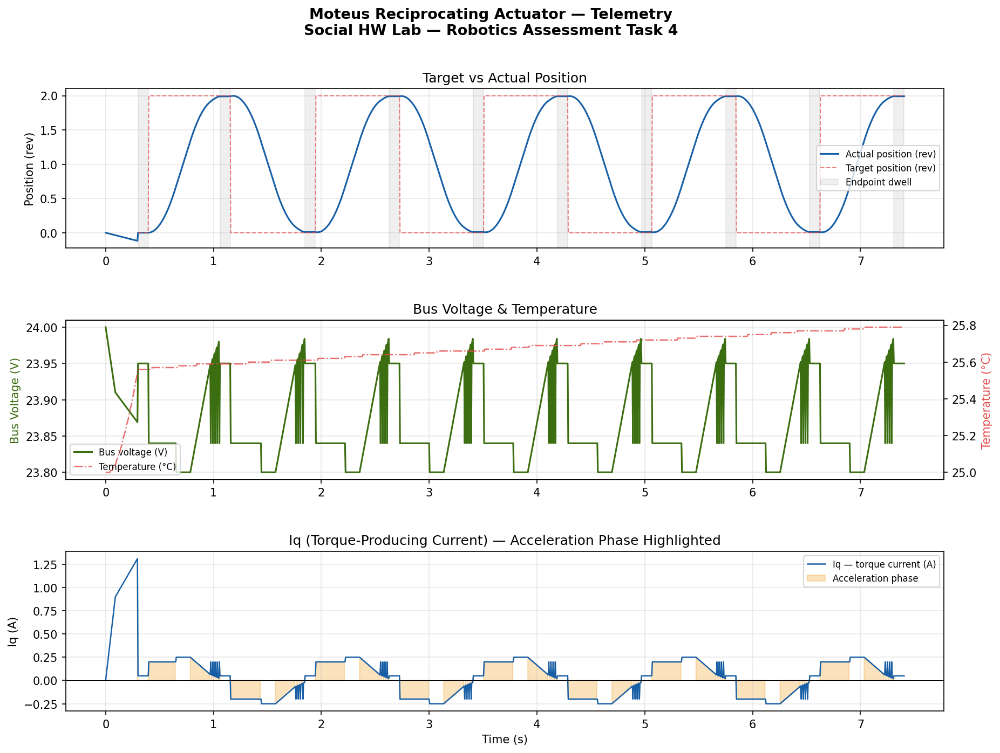

# Task 4 — High-Speed Reciprocating Actuator
**Social HW Lab — Robotics Engineer Assessment**
> Author: Srikar Reddy | March 2026

---

## Overview

Precision control of a **BLDC motor** via the `moteus` controller SDK. Executes a high-speed cyclic trajectory (0.0 ↔ 2.0 rev at 5 rev/s, 20 rev/s²) with safe torque-based homing, hardware watchdog management, and full telemetry logging.

---

## File Structure

```
Task4_ReciprocatingActuator/
├── moteus_reciprocating_actuator.py   # Main async control script
├── telemetry.csv                      # Raw telemetry log (1482 rows)
└── telemetry_plot.png                 # 3-panel analysis plot
```

---

## Installation

```bash
cd social-hw-robotics-engineer/Task4_ReciprocatingActuator
pip install moteus matplotlib numpy
```

---

## Usage

```bash
# Live run — requires moteus hardware + fdcanusb
python moteus_reciprocating_actuator.py

# Offline simulation — no hardware needed
python moteus_reciprocating_actuator.py --simulate

# Re-plot from existing telemetry.csv
python moteus_reciprocating_actuator.py --plot-only
```

---

## Hardware Setup

| Component | Detail |
|---|---|
| Controller | moteus n1 / r4.x / c1 |
| Communication | fdcanusb (default) or pi3hat |
| Motor | Any BLDC calibrated for moteus |
| Mechanical | Physical hard-stop at one end of travel |

---

## Three-Phase Execution

### Phase 1 — Safety & Homing

Writes hard limits to the controller before any motion:

```
MAX_CURRENT_A = 2.0 A
POS_MIN       = −0.05 rev
POS_MAX       =  2.10 rev
```

Torque-based homing: creeps toward the mechanical hard-stop at `0.1 rev/s` and detects contact when `q_current > 0.8 A`. Position zeroed at the hard-stop with a backlash preload offset to eliminate mechanical deadband on reversal.

### Phase 2 — Trajectory Execution

```
Trajectory:   0.0 ↔ 2.0 rev
Velocity:     5.0 rev/s
Acceleration: 20.0 rev/s²
Dwell:        100 ms at each endpoint
Cycles:       5 back-and-forth
```

The moteus watchdog requires a command every 100 ms or it faults. During endpoint dwells the script sends keep-alive commands every **50 ms** (2× safety margin).

### Phase 3 — Telemetry

Logs 9 fields per cycle to `telemetry.csv`:

| Column | Description |
|---|---|
| `timestamp_s` | Wall-clock time |
| `target_pos_rev` | Commanded position |
| `actual_pos_rev` | Measured rotor position |
| `actual_vel_revs` | Measured velocity |
| `q_current_A` | Torque-producing current (Iq) |
| `d_current_A` | Flux-producing current (Id) |
| `bus_voltage_V` | DC bus voltage |
| `temperature_C` | Controller temperature |
| `mode` | `homing` / `trajectory` / `dwell` |

---

## Telemetry Plot



- **Top** — Target vs actual position; actual tracks trapezoidal profile smoothly; dwell regions highlighted
- **Middle** — Bus voltage sags ~184 mV under load; temperature rises gradually within safe limits
- **Bottom** — Iq peaks during acceleration, reverses during deceleration (regenerative braking)

---

## Results

| Metric | Value |
|---|---|
| Total rows | 1482 |
| Position range | 0.001 – 1.998 rev |
| Peak Iq | ±0.25 A |
| Bus voltage sag | 184 mV (23.800 – 23.984 V) |
| Temperature rise | 25.0 → 25.8 °C |
